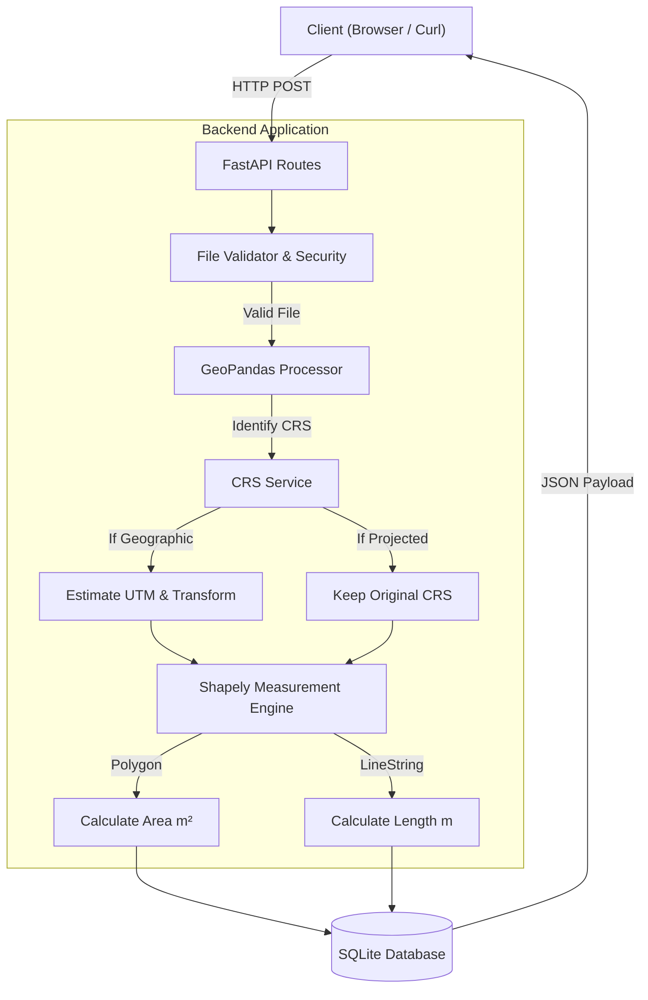

# api-Geospatial

A production-ready RESTful service built with FastAPI that accepts geospatial files (`.kml` and `.zip` containing Shapefiles), processes their features, dynamically estimates Coordinate Reference Systems (CRS), and calculates physical measurements such as Area (for Polygons) and Length (for LineStrings).

## 🚀 Features
- **KML & Shapefile Uploads**: Supports robust ingestion of standard geospatial formats.
- **Dynamic CRS Transformation**: Automatically estimates the correct UTM zone based on geographic bounds using `estimate_utm_crs()`, ensuring accurate physical measurements in meters/kilometers instead of meaningless geographic degrees.
- **Geometric Calculations**: High-performance area and length calculations powered by Shapely and GeoPandas.
- **Graceful Error Handling**: Unsupported geometries are handled individually without crashing the entire file processing batch.
- **Security First**: Prevents Zip Slip (path traversal) attacks and limits file sizes dynamically.
- **Dockerized**: Fully containerized for easy deployment and scaling.

---

## 🏗️ Architecture



---

## 📂 Project Structure

```text
geospatial-measurement-api/
├── app/
│   ├── api/
│   │   └── routes.py         # FastAPI route definitions
│   ├── db/
│   │   ├── database.py       # SQLAlchemy setup and engine
│   │   └── models.py         # Database models (File metadata, Features)
│   ├── services/
│   │   ├── crs.py            # CRS estimation and transformation logic
│   │   └── file_processor.py # File parsing, geometry extraction & measurement
│   └── main.py               # FastAPI application entry point
├── Dockerfile                # Docker container configuration
├── requirements.txt          # Python dependencies
└── README.md                 # Project documentation
```

---

## 🛠️ Tech Stack
- **Python 3.11+**: Primary language
- **FastAPI**: Modern, fast web framework
- **GeoPandas & Shapely**: Geospatial data processing and geometric calculations
- **PyProj**: Coordinate Reference System handling
- **SQLite & SQLAlchemy**: Database mapping and persistent storage
- **Pytest**: Automated testing framework
- **Docker**: Containerization

---

## 💻 Installation & Setup

### Option 1: Local Virtual Environment
```bash
# 1. Clone the repository
git clone https://github.com/Satyaprakash1235/api-Geospatial.git
cd api-Geospatial

# 2. Create and activate a virtual environment
python -m venv venv
source venv/bin/activate  # On Windows use `venv\Scripts\activate`

# 3. Install dependencies
pip install -r requirements.txt

# 4. Run the API server
uvicorn app.main:app --reload
```

### Option 2: Docker
```bash
# Build the Docker image
docker build -t geospatial-api .

# Run the container
docker run -p 8000:8000 geospatial-api
```

Alternatively, using `docker-compose`:
```bash
docker-compose up --build
```

---

## 📡 API Endpoints

Once the application is running, you can explore the interactive Swagger documentation at **[http://localhost:8000/docs](http://localhost:8000/docs)**.

### 1. Upload a File
```http
POST /api/files/
```
**Description:** Uploads a `.kml` or `.zip` (containing `.shp`, `.shx`, `.dbf`).
**Curl Example:**
```bash
curl -X POST http://localhost:8000/api/files/ -F "file=@sample.kml"
```

### 2. Get File Information
```http
GET /api/files/{id}/
```
**Description:** Retrieves top-level metadata about a previously uploaded file.

### 3. Get Feature Measurements
```http
GET /api/files/{id}/measurements/
```
**Description:** Retrieves a detailed breakdown of all features, their extracted properties, dynamic CRS, and geometric measurements.

**Example Response:**
```json
{
  "file_id": "abc12345",
  "filename": "sample.kml",
  "original_crs": "EPSG:4326",
  "measurement_crs": "EPSG:32643",
  "features": [
    {
      "feature_id": 0,
      "geometry_type": "Polygon",
      "crs": "EPSG:4326",
      "properties": {
        "Name": "Survey Area"
      },
      "measurement": {
        "type": "area",
        "value": 125430.52,
        "unit": "m²"
      },
      "status": "COMPLETED",
      "message": null
    }
  ]
}
```

---

## 🧪 Testing

To run the automated test suite, execute:
```bash
pytest
```
This suite covers API integrations, missing CRS scenarios, corrupted ZIP prevention, and geometry validations.

---

## 🌟 Real-World Applications

This Geospatial API is designed to solve complex geographic calculation problems with zero setup required by end-users. It can be used for:
- **Urban Planning & Construction:** Instantly calculate the land area of plots submitted by surveyors.
- **Agriculture:** Measure field perimeters and arable land sizes directly from drone or satellite vector data.
- **Logistics & Routing:** Calculate true road or pipeline lengths from GPS traces.
- **Environmental Monitoring:** Analyze the size of deforestation zones, water bodies, or protected areas from Shapefiles.

---

## 🔮 Future Scope

While the current API handles foundational geospatial calculations robustly, here are a few directions for future enhancements:
1. **Support for More Formats:** Add support for GeoJSON, TopoJSON, and Geopackage (.gpkg) file uploads.
2. **Advanced Geoprocessing:** Introduce endpoints for buffering, intersection, and union operations between multiple uploaded files.
3. **Interactive Maps:** Integrate a frontend map viewer (like Leaflet or Mapbox) directly connected to the API to visualize the parsed geometries.
4. **Cloud Storage Integration:** Connect directly to AWS S3 or Google Cloud Storage to pull datasets rather than relying solely on direct HTTP uploads.
5. **Batch Processing:** Add asynchronous endpoints (using Celery/Redis) to process massive datasets (e.g., city-wide building footprints) in the background.
